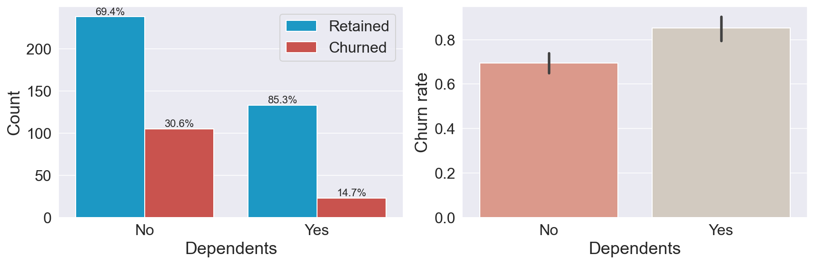
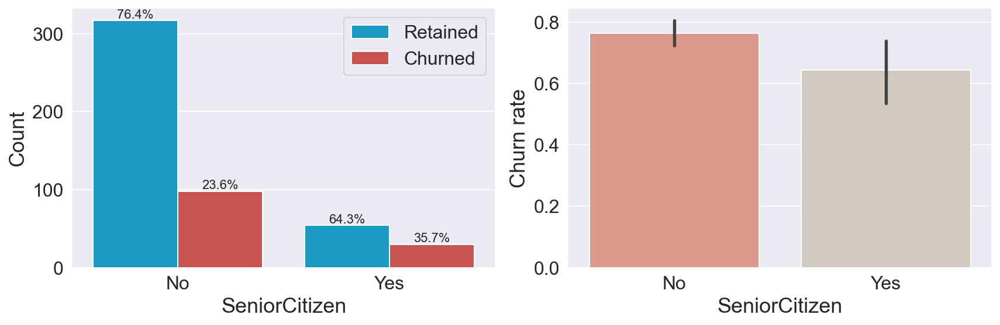

<font size=+3><center><b>Telco Churn Prediction with ML Insights 📈</b></center></font>


<font size=+1><left><b>Table of Contents</b></left></font>

- [Introduction](#Introduction)
- [Objective](#Objective)
- [Libraries](#Libraries)
- [Default Setting](#Default-Setting)
- [Functions](#Functions)
- [A Quick Look at our Data](#A-Quick-Look-at-our-Data)
    - [Data Attributes](#Dataset-Attributes)
- [Creating a Test Set](#Creating-a-Test-Set)
- [Exploratory Data Analysis](#Exploratory-Data-Analysis)
    - [Target variable: Churn](#Target-variable:-Churn)
    - [Continuous Variables](#Continuous-Variables)
    - [Categorical Variables](#Categorical-Variables)
- [Data Preprocessing](#Data-Preprocessing)
    - [Feature Selection](#Feature-Selection)
    - [Encoding Categorical Features](#Encoding-Categorical-Features)
    - [Scaling](#Scaling)
    - [Addressing Class Imbalance](#Addressing-Class-Imbalance)
- [Building Machine Learning Models](#Building-Machine-Learning-Models)
    - [Baseline Models](#Baseline-Models)
    - [Model Tuning](#Model-Tuning)
- [Results](#Results)
    - [Learning Curves](#Learning-Curves)
    - [Feature Importance](#Feature-Importance)
    - [Performance Comparison](#Performance-Comparison)
- [Evaluating the Test Set](#Evaluating-the-Test-Set)
- [Bibliography](#Bibliography)
- [Future Development](#Future-Development)
- [Conclusions](#Conclusions)

# Introduciton

Customer churn refers to the situation when a customer discontinues using a company's product or service, and it poses a significant challenge for businesses as it can lead to financial losses and hinder growth. 

Understanding the reasons behind customer churn and taking proactive measures to prevent it are crucial for long-term success. Various industries, including banks, telecom providers, internet service providers, and streaming platforms like Netflix, heavily rely on customer subscriptions, making customer churn analysis particularly important. 

Therefore, customer churn analysis is essential as it can help a business:

- Understand Customers
    
    Customer churn analysis helps businesses understand customer behavior, preferences, and reasons for leaving, such as poor product/service issues, poor customer support, or wrong targeting.


- Optimize Strategies 
    
    By leveraging churn analysis insights, businesses can improve their product/service offerings, enhance customer support, and optimize marketing strategies to increase customer retention, leading to business growth.

# Objective

Our objective involves conducting **exploratory data analysis (EDA)** to uncover patterns and insights in customer data. This includes creating informative visualizations and performing data engineering to extract relevant features. The insights gained from EDA will inform the subsequent step of building predictive models. 

We will develop robust models using **statistical methods** and **machine learning algorithms**, treating churn prediction as a binary classification problem. We will prioritize recall as a performance metric to capture the importance of identifying customers who are likely to churn. 

Based on the analysis, we will **derive actionable insights** to implement strategies aimed at reducing customer churn and maximizing customer retention.

By following to the provided guidelines, I would like to answer intriguing questions that I have discovered:


# Library


```python
import warnings
warnings.simplefilter(action='ignore', category=FutureWarning)

import numpy as np
import pandas as pd
pd.set_option('precision', 3)

# Data Visualisation Libraries
import matplotlib.pyplot as plt
%config InlineBackend.figure_format = 'retina'

!pip install seaborn --upgrade
import seaborn as sns
sns.set_style('darkgrid')

# Statistics
from scipy.stats import chi2_contingency
from imblearn.over_sampling import SMOTE

# Machine Learning
from sklearn.model_selection import train_test_split, GridSearchCV
from sklearn.model_selection import cross_val_score, cross_val_predict
from sklearn.model_selection import learning_curve

from sklearn.preprocessing import OneHotEncoder, LabelEncoder, StandardScaler, MinMaxScaler

from sklearn.naive_bayes import GaussianNB
from sklearn.linear_model import LogisticRegression
from sklearn.svm import SVC
from sklearn.ensemble import RandomForestClassifier, GradientBoostingClassifier, VotingClassifier
from xgboost import XGBClassifier
from lightgbm import LGBMClassifier

from sklearn.metrics import accuracy_score, recall_score, precision_score, auc, roc_auc_score, roc_curve
from sklearn.metrics import confusion_matrix

print('✔️ Libraries Imported!')
```

    Requirement already satisfied: seaborn in c:\users\user\anaconda3\lib\site-packages (0.12.2)
    Requirement already satisfied: numpy!=1.24.0,>=1.17 in c:\users\user\anaconda3\lib\site-packages (from seaborn) (1.20.1)
    Requirement already satisfied: matplotlib!=3.6.1,>=3.1 in c:\users\user\anaconda3\lib\site-packages (from seaborn) (3.3.4)
    Requirement already satisfied: pandas>=0.25 in c:\users\user\anaconda3\lib\site-packages (from seaborn) (1.2.4)
    Requirement already satisfied: kiwisolver>=1.0.1 in c:\users\user\anaconda3\lib\site-packages (from matplotlib!=3.6.1,>=3.1->seaborn) (1.3.1)
    Requirement already satisfied: pillow>=6.2.0 in c:\users\user\anaconda3\lib\site-packages (from matplotlib!=3.6.1,>=3.1->seaborn) (8.2.0)
    Requirement already satisfied: cycler>=0.10 in c:\users\user\anaconda3\lib\site-packages (from matplotlib!=3.6.1,>=3.1->seaborn) (0.10.0)
    Requirement already satisfied: pyparsing!=2.0.4,!=2.1.2,!=2.1.6,>=2.0.3 in c:\users\user\anaconda3\lib\site-packages (from matplotlib!=3.6.1,>=3.1->seaborn) (2.4.7)
    Requirement already satisfied: python-dateutil>=2.1 in c:\users\user\anaconda3\lib\site-packages (from matplotlib!=3.6.1,>=3.1->seaborn) (2.8.1)
    Requirement already satisfied: six in c:\users\user\anaconda3\lib\site-packages (from cycler>=0.10->matplotlib!=3.6.1,>=3.1->seaborn) (1.15.0)
    Requirement already satisfied: pytz>=2017.3 in c:\users\user\anaconda3\lib\site-packages (from pandas>=0.25->seaborn) (2021.1)
    ✔️ Libraries Imported!
    

# Default Setting


```python
# pd.options.display.max_rows = None
# pd.options.display.max_columns = None

font_size = 18
plt.rcParams['axes.labelsize'] = font_size
plt.rcParams['axes.titlesize'] = font_size + 2
plt.rcParams['xtick.labelsize'] = font_size - 2
plt.rcParams['ytick.labelsize'] = font_size - 2
plt.rcParams['legend.fontsize'] = font_size - 2

colors = ['#00A5E0', '#DD403A']
colors_cat = ['#E8907E', '#D5CABD', '#7A6F86', '#C34A36', '#B0A8B9', '#845EC2', '#8f9aaa', '#FFB86F', '#63BAAA', '#9D88B3', '#38c4e3']
colors_comp = ['steelblue', 'seagreen', 'black', 'darkorange', 'purple', 'firebrick', 'slategrey']

random_state = 42
scoring_metric = 'recall'
comparison_dict, comparison_test_dict = {}, {}

print('✔️ Default Setting Done!')
```

    ✔️ Default Setting Done!
    

# Function

## plot_continuous_by_target()


```python
def plot_continuous_by_target(feature, target, labels):
    '''
    Plot a histogram and boxplot for the distributions of the specified feature, 
    grouped by the target variable
    
    Args:
        feature: str
            column name of the selected feature

        target: str
            column name of the target variable

        labels: list[str]
            category of the target variable
    '''
    
    

    fig, (ax1, ax2) = plt.subplots(2,
                                   figsize=(9, 7),
                                   sharex=True,
                                   gridspec_kw={'height_ratios': (.7, .3)})

    sns.histplot(data=df, x=feature, hue = target, color=colors, edgecolor='black', 
                 multiple='layer', alpha=0.33, ax = ax1)
    
#     ax1.legend(labels=sorted(labels))

    sns.boxplot(y=target, x = feature, hue = target, data = df, ax = ax2)
    ax2.set_ylabel('')
    ax2.set_yticklabels(labels)
    ax2.set_ylabel('')
    ax2.legend_.remove()
    plt.tight_layout();


print('✔️ Function Defined!')
```

    ✔️ Function Defined!
    

## percentage_above_bar_relative_to_xgroup()


```python
def percentage_above_bar_relative_to_xgroup(ax):
    all_heights = [[p.get_height() for p in bars] for bars in ax.containers]
    for bars in ax.containers:
        for i, p in enumerate(bars):
            total = sum(xgroup[i] for xgroup in all_heights)
            percentage = f'{(100 * p.get_height() / total) :.1f}%'
            ax.annotate(percentage, (p.get_x() + p.get_width() / 2, p.get_height()), size=11, ha='center', va='bottom')

print('✔️ Function Defined!')
```

    ✔️ Function Defined!
    

## plot_categorical_by_target()


```python
def plot_categorical_by_target(feature, target, label):
    '''
    Plot counterplot for the distributions of the specified feature, 
    grouped by the target variable
    
    Args:
        feature: str
            column name of the selected feature

        target: str
            column name of the target variable

        labels: list[str]
            category of the target variable
    '''
    fig, (ax1, ax2) = plt.subplots(1, 2, figsize=(12, 4))

    sns.countplot(x=feature,
                  hue=target,
                  data=df,
                  palette=colors,
                  ax=ax1)
    percentage_above_bar_relative_to_xgroup(ax1)
    ax1.set_ylabel('Count')
    ax1.legend(['Retained', 'Churned'])
    
    
#     Because df[target] has not been encoded, 
#         we need to encode it to calculate the percentage in barplot
    encode_target = LabelEncoder().fit_transform(df['Churn'])
    sns.barplot(x=feature,
                y=encode_target,
                data=df,
                palette=colors_cat,
                ax=ax2)
    ax2.set_ylabel('Churn rate')

    plt.tight_layout();


print('✔️ Function Defined!')
```

    ✔️ Function Defined!
    

## scale_continuous_variables()


```python
def scale_continuous_variables(data, scaling_method):
    """
    Scale the continuous variables in a DataFrame (copied from the input dataframe) using a specified scaling method.

    Args:
        data (pandas.DataFrame): 
            The input DataFrame.
            
        scaling_method (str): 
            The scaling method to be used. Options: 'standard', 'minmax'.

    Returns:
        pandas.DataFrame: The DataFrame with the scaled continuous variables.
    """

    scaler = None
    if scaling_method == 'standard':
        scaler = StandardScaler()
    elif scaling_method == 'minmax':
        scaler = MinMaxScaler()
    else:
        raise ValueError("Invalid scaling method. Please choose 'standard' or 'minmax'.")

    scaled_data = data.copy()
    scaled_data = scaler.fit_transform(scaled_data)

    return scaled_data

```

## plot_conf_mx


```python
def plot_conf_mx(cm, ax):
    
    '''
    Plot a confusion matrix in the specified axes object.

    Args:
        cm (numpy.ndarray or pandas.DataFrame): 
            The confusion matrix to be plotted.
            
        ax (matplotlib.axes.Axes): 
            The axes object where the confusion matrix will be plotted.

    Returns:
        None
    '''
    
    sns.heatmap(data=cm,
                annot=True,
                cmap='Blues',
                annot_kws={'fontsize': 30},
                ax=ax)

    ax.set_xlabel('Predicted Label')
    ax.set_xticks([0.5, 1.5])
    ax.set_xticklabels(['Retained', 'Churned'])

    ax.set_ylabel('True Label')
    ax.set_yticks([0.25, 1.25])
    ax.set_yticklabels(['Retained', 'Churned']);


print('✔️ Function Defined!')
```

    ✔️ Function Defined!
    

## plot_learning_curve()


```python
def plot_learning_curve(estimator, X, y, ax, cv=None, train_sizes=np.linspace(0.1, 1.0, 5)):
    '''
    Plot the learning curves for an estimator in the specified axes object.

    Args:
        estimator (scikit-learn estimator): 
            The estimator object for which learning curves will be plotted.
        
        X (numpy.ndarray or pandas.DataFrame): 
            The input features.
        
        y (numpy.ndarray or pandas.Series): 
            The target variable.
        
        ax (matplotlib.axes.Axes): 
            The axes object where the learning curves will be plotted.
        
        cv (int or cross-validation generator, default=None): 
            Determines the cross-validation strategy. If None, default 5-fold cross-validation will be used.
        
        train_sizes (numpy.ndarray, default=np.linspace(0.1, 1.0, 5)): 
            The training sizes to use for generating the learning curves.

    Returns:
        None
    '''
    # Compute learning curves
    train_sizes, train_scores, test_scores = learning_curve(
        estimator,
        X,
        y,
        cv=cv,
        n_jobs=-1,
        train_sizes=train_sizes,
        scoring='accuracy')

    # Compute mean and standard deviation of scores
    train_scores_mean = np.mean(train_scores, axis=1)
    train_scores_std = np.std(train_scores, axis=1)
    test_scores_mean = np.mean(test_scores, axis=1)
    test_scores_std = np.std(test_scores, axis=1)

    # Plot filled areas to represent the range of scores
    ax.fill_between(train_sizes,
                    train_scores_mean - train_scores_std,
                    train_scores_mean + train_scores_std,
                    alpha=0.1,
                    color='dodgerblue',
                    label='Training Score ± Std Dev')
    ax.fill_between(train_sizes,
                    test_scores_mean - test_scores_std,
                    test_scores_mean + test_scores_std,
                    alpha=0.1,
                    color='darkorange',
                    label='Cross-validation Score ± Std Dev')

    # Plot the learning curves with markers and lines
    ax.plot(train_sizes,
            train_scores_mean,
            color='dodgerblue',
            marker='o',
            linestyle='-',
            label='Training Score')
    ax.plot(train_sizes,
            test_scores_mean,
            color='darkorange',
            marker='o',
            linestyle='-',
            label='Cross-validation Score')

    # Set the axes labels and legend
    ax.set_xlabel('Training Examples')
    ax.set_ylabel('Score')
    ax.legend(loc='best', fontsize=14)

```

## clf_performance()


```python
def clf_performance(classifier, classifier_name, classifier_name_abv):
    '''
    Display the overall performance of a classifier with this template.

    Args:
        classifier (scikit-learn classifier object): 
            The classifier object for which the performance will be evaluated.
        
        classifier_name (str): 
            The name of the classifier.
        
        classifier_name_abv (str): 
            The abbreviated name of the classifier.

    Returns:
        None
    '''
    print('\n', classifier_name)
    print('-------------------------------')
    print('   Best Score ({}): '.format(scoring_metric) + str(np.round(classifier.best_score_, 3)))
    print('   Best Parameters: ')
    for key, value in classifier.best_params_.items():
        print('      {}: {}'.format(key, value))

    y_pred_pp = cross_val_predict(estimator=classifier.best_estimator_,
                                  X=X_train,
                                  y=y_train,
                                  cv=10,
                                  method='predict_proba')[:, 1]
    y_pred = y_pred_pp.round()

    cm = confusion_matrix(y_train, y_pred, normalize='true')

    fpr, tpr, _ = roc_curve(y_train, y_pred_pp)
    comparison_dict[classifier_name_abv] = [
        accuracy_score(y_train, y_pred),
        precision_score(y_train, y_pred),
        recall_score(y_train, y_pred),
        roc_auc_score(y_train, y_pred_pp), fpr, tpr
    ]

    fig, (ax1, ax2) = plt.subplots(1, 2, figsize=(12, 5))

    plot_conf_mx(cm, ax1)
    plot_learning_curve(classifier.best_estimator_, X_train, y_train, ax2)

    plt.tight_layout()


print('✔️ Function Defined!')
```

    ✔️ Function Defined!
    

## test_func()


```python
def test_func(classifier, classifier_name, ax):
    '''
    Assess the performance on the test set and plot the confusion matrix.
    
    Args:
        classifier (scikit-learn classifier object): 
            The classifier object for which the performance will be assessed.
        
        classifier_name (str): 
            The name of the classifier.
        
        ax (matplotlib.axes.Axes): 
            The axes object where the confusion matrix will be plotted.
    
    Returns:
        None
    '''
    y_pred = classifier.predict(X_test)
    cm = confusion_matrix(y_test, y_pred, normalize='true')

    comparison_test_dict[classifier_name] = [accuracy_score(y_test, y_pred),
                                             precision_score(y_test, y_pred),
                                             recall_score(y_test, y_pred)]

    sns.heatmap(cm,
                annot=True,
                annot_kws={'fontsize': 24},
                cmap='Blues',
                ax=ax)

    ax.set_title(classifier_name)

    ax.set_xlabel('Predicted Label')
    ax.set_xticks([0.5, 1.5])
    ax.set_xticklabels(['Retained', 'Churned'])

    ax.set_ylabel('True Label')
    ax.set_yticks([0.2, 1.4])
    ax.set_yticklabels(['Retained', 'Churned']);


print('✔️ Function Defined!')
```

    ✔️ Function Defined!
    


```python

```


```python

```

# A Quick Look at our Data

## Dataset Attributes
    
- **customerID** : Customer ID
- **gender** : Whether the customer is a male or a female
- **SeniorCitizen** : Whether the customer is a senior citizen or not (1, 0)
- **Partner** : Whether the customer has a partner or not (Yes, No)
- **Dependents** : Whether the customer has dependents or not (Yes, No)
- **tenure** : Number of months the customer has stayed with the company
- **PhoneService** : Whether the customer has a phone service or not (Yes, No)
- **MultipleLines** : Whether the customer has multiple lines or not (Yes, No, No phone service)
- **InternetService** : Customer’s internet service provider (DSL, Fiber optic, No)
- **OnlineSecurity** : Whether the customer has online security or not (Yes, No, No internet service)
- **OnlineBackup** : Whether the customer has online backup or not (Yes, No, No internet service)
- **DeviceProtection** : Whether the customer has device protection or not (Yes, No, No internet service)
- **TechSupport** : Whether the customer has tech support or not (Yes, No, No internet service)
- **StreamingTV** : Whether the customer has streaming TV or not (Yes, No, No internet service)
- **StreamingMovies** : Whether the customer has streaming movies or not (Yes, No, No internet service)
- **Contract** : The contract term of the customer (Month-to-month, One year, Two year)
- **PaperlessBilling** : Whether the customer has paperless billing or not (Yes, No)
- **PaymentMethod** : The customer’s payment method (Electronic check, Mailed check, Bank transfer (automatic), Credit card (automatic))
- **MonthlyCharges** : The amount charged to the customer monthly
- **TotalCharges** : The total amount charged to the customer
- **Churn** : Whether the customer churned or not (Yes or No)


```python
df = pd.read_csv('./WA_Fn-UseC_-Telco-Customer-Churn.csv')[1:500]

print('✔️ Dataset Imported Successfully!\n')
print('It contains {} rows and {} columns.'.format(df.shape[0], df.shape[1]))
df.head()
```

    ✔️ Dataset Imported Successfully!
    
    It contains 499 rows and 21 columns.
    


<div>
<style scoped>
    .dataframe tbody tr th:only-of-type {
        vertical-align: middle;
    }

    .dataframe tbody tr th {
        vertical-align: top;
    }

    .dataframe thead th {
        text-align: right;
    }
</style>
<table border="1" class="dataframe">
  <thead>
    <tr style="text-align: right;">
      <th></th>
      <th>customerID</th>
      <th>gender</th>
      <th>SeniorCitizen</th>
      <th>Partner</th>
      <th>Dependents</th>
      <th>tenure</th>
      <th>PhoneService</th>
      <th>MultipleLines</th>
      <th>InternetService</th>
      <th>OnlineSecurity</th>
      <th>...</th>
      <th>DeviceProtection</th>
      <th>TechSupport</th>
      <th>StreamingTV</th>
      <th>StreamingMovies</th>
      <th>Contract</th>
      <th>PaperlessBilling</th>
      <th>PaymentMethod</th>
      <th>MonthlyCharges</th>
      <th>TotalCharges</th>
      <th>Churn</th>
    </tr>
  </thead>
  <tbody>
    <tr>
      <th>1</th>
      <td>5575-GNVDE</td>
      <td>Male</td>
      <td>0</td>
      <td>No</td>
      <td>No</td>
      <td>34</td>
      <td>Yes</td>
      <td>No</td>
      <td>DSL</td>
      <td>Yes</td>
      <td>...</td>
      <td>Yes</td>
      <td>No</td>
      <td>No</td>
      <td>No</td>
      <td>One year</td>
      <td>No</td>
      <td>Mailed check</td>
      <td>56.95</td>
      <td>1889.5</td>
      <td>No</td>
    </tr>
    <tr>
      <th>2</th>
      <td>3668-QPYBK</td>
      <td>Male</td>
      <td>0</td>
      <td>No</td>
      <td>No</td>
      <td>2</td>
      <td>Yes</td>
      <td>No</td>
      <td>DSL</td>
      <td>Yes</td>
      <td>...</td>
      <td>No</td>
      <td>No</td>
      <td>No</td>
      <td>No</td>
      <td>Month-to-month</td>
      <td>Yes</td>
      <td>Mailed check</td>
      <td>53.85</td>
      <td>108.15</td>
      <td>Yes</td>
    </tr>
    <tr>
      <th>3</th>
      <td>7795-CFOCW</td>
      <td>Male</td>
      <td>0</td>
      <td>No</td>
      <td>No</td>
      <td>45</td>
      <td>No</td>
      <td>No phone service</td>
      <td>DSL</td>
      <td>Yes</td>
      <td>...</td>
      <td>Yes</td>
      <td>Yes</td>
      <td>No</td>
      <td>No</td>
      <td>One year</td>
      <td>No</td>
      <td>Bank transfer (automatic)</td>
      <td>42.30</td>
      <td>1840.75</td>
      <td>No</td>
    </tr>
    <tr>
      <th>4</th>
      <td>9237-HQITU</td>
      <td>Female</td>
      <td>0</td>
      <td>No</td>
      <td>No</td>
      <td>2</td>
      <td>Yes</td>
      <td>No</td>
      <td>Fiber optic</td>
      <td>No</td>
      <td>...</td>
      <td>No</td>
      <td>No</td>
      <td>No</td>
      <td>No</td>
      <td>Month-to-month</td>
      <td>Yes</td>
      <td>Electronic check</td>
      <td>70.70</td>
      <td>151.65</td>
      <td>Yes</td>
    </tr>
    <tr>
      <th>5</th>
      <td>9305-CDSKC</td>
      <td>Female</td>
      <td>0</td>
      <td>No</td>
      <td>No</td>
      <td>8</td>
      <td>Yes</td>
      <td>Yes</td>
      <td>Fiber optic</td>
      <td>No</td>
      <td>...</td>
      <td>Yes</td>
      <td>No</td>
      <td>Yes</td>
      <td>Yes</td>
      <td>Month-to-month</td>
      <td>Yes</td>
      <td>Electronic check</td>
      <td>99.65</td>
      <td>820.5</td>
      <td>Yes</td>
    </tr>
  </tbody>
</table>
<p>5 rows × 21 columns</p>
</div>


```python
df.drop(['customerID'], axis = 1, inplace = True)
df.columns
```


    Index(['gender', 'SeniorCitizen', 'Partner', 'Dependents', 'tenure',
           'PhoneService', 'MultipleLines', 'InternetService', 'OnlineSecurity',
           'OnlineBackup', 'DeviceProtection', 'TechSupport', 'StreamingTV',
           'StreamingMovies', 'Contract', 'PaperlessBilling', 'PaymentMethod',
           'MonthlyCharges', 'TotalCharges', 'Churn'],
          dtype='object')


The `info()` method can give us valuable information such as the number of non-null values and the type of each feature:


```python
df.info()
```

    <class 'pandas.core.frame.DataFrame'>
    RangeIndex: 499 entries, 1 to 499
    Data columns (total 20 columns):
     #   Column            Non-Null Count  Dtype  
    ---  ------            --------------  -----  
     0   gender            499 non-null    object 
     1   SeniorCitizen     499 non-null    int64  
     2   Partner           499 non-null    object 
     3   Dependents        499 non-null    object 
     4   tenure            499 non-null    int64  
     5   PhoneService      499 non-null    object 
     6   MultipleLines     499 non-null    object 
     7   InternetService   499 non-null    object 
     8   OnlineSecurity    499 non-null    object 
     9   OnlineBackup      499 non-null    object 
     10  DeviceProtection  499 non-null    object 
     11  TechSupport       499 non-null    object 
     12  StreamingTV       499 non-null    object 
     13  StreamingMovies   499 non-null    object 
     14  Contract          499 non-null    object 
     15  PaperlessBilling  499 non-null    object 
     16  PaymentMethod     499 non-null    object 
     17  MonthlyCharges    499 non-null    float64
     18  TotalCharges      499 non-null    object 
     19  Churn             499 non-null    object 
    dtypes: float64(1), int64(2), object(17)
    memory usage: 78.1+ KB
    

Handle with the column with the wrong data type


```python
df.loc[df['TotalCharges']== ' ', 'TotalCharges'] = 0 
df['TotalCharges'] = df['TotalCharges'].astype('float')
df['SeniorCitizen']  = df['SeniorCitizen'].astype('category')
```

Modify the categories of the category variable


```python
df['SeniorCitizen'] = df['SeniorCitizen'].map({0:'No',1:'Yes'})
```

Separate the continuous and categorical variables from a DataFrame, with the exclusion of the target variable.


```python
continuous = sorted(df.select_dtypes(include=['float64', 'int64']).columns.tolist())
categorical = sorted(df.select_dtypes(include=['object', 'category']).columns.tolist())

if 'Churn' in continuous:
    continuous.remove('Churn')
else:
    categorical.remove('Churn')

print('Continuous: ', ', '.join(continuous))
print('Categorical: ', ', '.join(categorical))
```

    Continuous:  MonthlyCharges, TotalCharges, tenure
    Categorical:  Contract, Dependents, DeviceProtection, InternetService, MultipleLines, OnlineBackup, OnlineSecurity, PaperlessBilling, Partner, PaymentMethod, PhoneService, SeniorCitizen, StreamingMovies, StreamingTV, TechSupport, gender
    


```python
df[categorical] = df[categorical].astype('category')
```


```python
df.info()
```

    <class 'pandas.core.frame.DataFrame'>
    RangeIndex: 499 entries, 1 to 499
    Data columns (total 20 columns):
     #   Column            Non-Null Count  Dtype   
    ---  ------            --------------  -----   
     0   gender            499 non-null    category
     1   SeniorCitizen     499 non-null    category
     2   Partner           499 non-null    category
     3   Dependents        499 non-null    category
     4   tenure            499 non-null    int64   
     5   PhoneService      499 non-null    category
     6   MultipleLines     499 non-null    category
     7   InternetService   499 non-null    category
     8   OnlineSecurity    499 non-null    category
     9   OnlineBackup      499 non-null    category
     10  DeviceProtection  499 non-null    category
     11  TechSupport       499 non-null    category
     12  StreamingTV       499 non-null    category
     13  StreamingMovies   499 non-null    category
     14  Contract          499 non-null    category
     15  PaperlessBilling  499 non-null    category
     16  PaymentMethod     499 non-null    category
     17  MonthlyCharges    499 non-null    float64 
     18  TotalCharges      499 non-null    float64 
     19  Churn             499 non-null    object  
    dtypes: category(16), float64(2), int64(1), object(1)
    memory usage: 25.6+ KB
    


```python
# Modify the category designation for the subsequent visualization
df['Churn'] = df['Churn'].map({'Yes':'Exited','No':'Retained'})
```

# Exploratory Data Analysis
## Target variable: Churn


```python
target = 'Churn'
labels = ['Retained', 'Exited']
sizes = df['Churn'].value_counts()
explode = (0, 0.1)
fig1, ax1 = plt.subplots(figsize=(10, 8))
ax1.pie(sizes, explode=explode, labels = labels, colors = colors, autopct='%.1f%%', 
        shadow=True, startangle=90)
ax1.axis('equal')
plt.title("Proportion of customer churned and retained", size = 20)
plt.show()
```


    

    


**Inbalanced dataset**


## Continuous variable


```python
df[continuous].hist(figsize=(12, 10),
                          bins=20,
                          layout=(2, 2),
                          color='steelblue',
                          linewidth=1.5);
```


    

    


```python
plot_continuous_by_target('tenure', target, labels)
```


    

    


```python
plot_continuous_by_target('MonthlyCharges', target, labels = labels)
```


    

    


```python
plot_continuous_by_target('TotalCharges', target, labels)
```


    

    


### Correlations between continuous variable


```python
fig, ax = plt.subplots(figsize=(7, 6))

sns.heatmap(df[continuous].corr(),
            annot=True,
            annot_kws={'fontsize': 16},
            cmap='Blues',
            ax=ax)

ax.tick_params(axis='x', rotation=45)
ax.tick_params(axis='y', rotation=360);
```


    

    


## Categorical variable


```python
c_num = 2
r_num = int(np.ceil(len(categorical)/c_num))


fig, ax = plt.subplots(r_num, c_num, figsize=(16, 4.5*r_num))

for index, column in enumerate(categorical):
    
    plt.subplot(r_num, c_num, index + 1)
    sns.countplot(x=column, data=df, palette=colors_cat, width=0.8)
    plt.ylabel('')

# ax[r_num-1, -1].axis('off')

plt.tight_layout();
```


    

    


```python
for col_name in categorical:
    plot_categorical_by_target(col_name, target, labels)
```


    

    


    

    


    

    


    

    


    

    


    

    


    

    


    

    


    

    


    

    


    

    


    

    


    

    


    

    


    

    


    

    


# Data Preprocessing

## Feature selection


```python

```

## Scale Continuos Features


```python
df[continuous] = scale_continuous_variables(df[continuous], 'standard')
```

## Encode Categorical Features

We encode target variable as
- 0 for customers who have stopped subscribing to the service
- 1 for customers who continue their subscription


```python
map_dict = {'Retained': 0, 'Exited': 1}
df[target] = df[target].map(map_dict)
print(target, ' : ', [key for key in map_dict.keys()], '->', [value for value in map_dict.values()])
```

    Churn  :  ['Retained', 'Exited'] -> [0, 1]
    


```python

```


```python
df_onehot = df.copy()
df_label = df.copy()
```


```python
le = LabelEncoder()
for col_name in categorical :
    df_label[col_name] = le.fit_transform(df_label[col_name])
    print(col_name,' : ', le.inverse_transform(sorted(df_label[col_name].unique())),
          '->',sorted(df_label[col_name].unique()))
    
print('✔️ Features Encoded!')
```

    Contract  :  ['Month-to-month' 'One year' 'Two year'] -> [0, 1, 2]
    Dependents  :  ['No' 'Yes'] -> [0, 1]
    DeviceProtection  :  ['No' 'No internet service' 'Yes'] -> [0, 1, 2]
    InternetService  :  ['DSL' 'Fiber optic' 'No'] -> [0, 1, 2]
    MultipleLines  :  ['No' 'No phone service' 'Yes'] -> [0, 1, 2]
    OnlineBackup  :  ['No' 'No internet service' 'Yes'] -> [0, 1, 2]
    OnlineSecurity  :  ['No' 'No internet service' 'Yes'] -> [0, 1, 2]
    PaperlessBilling  :  ['No' 'Yes'] -> [0, 1]
    Partner  :  ['No' 'Yes'] -> [0, 1]
    PaymentMethod  :  ['Bank transfer (automatic)' 'Credit card (automatic)' 'Electronic check'
     'Mailed check'] -> [0, 1, 2, 3]
    PhoneService  :  ['No' 'Yes'] -> [0, 1]
    SeniorCitizen  :  ['No' 'Yes'] -> [0, 1]
    StreamingMovies  :  ['No' 'No internet service' 'Yes'] -> [0, 1, 2]
    StreamingTV  :  ['No' 'No internet service' 'Yes'] -> [0, 1, 2]
    TechSupport  :  ['No' 'No internet service' 'Yes'] -> [0, 1, 2]
    gender  :  ['Female' 'Male'] -> [0, 1]
    ✔️ Features Encoded!
    


```python
encoded_data = pd.get_dummies(df_onehot[categorical], drop_first=True)
df_onehot = pd.concat([df_onehot.drop(categorical, axis=1, inplace = False), encoded_data], axis=1)
np.shape(df_onehot)
```


    (499, 31)


```python
df_onehot
```


<div>
<style scoped>
    .dataframe tbody tr th:only-of-type {
        vertical-align: middle;
    }

    .dataframe tbody tr th {
        vertical-align: top;
    }

    .dataframe thead th {
        text-align: right;
    }
</style>
<table border="1" class="dataframe">
  <thead>
    <tr style="text-align: right;">
      <th></th>
      <th>tenure</th>
      <th>MonthlyCharges</th>
      <th>TotalCharges</th>
      <th>Churn</th>
      <th>Contract_One year</th>
      <th>Contract_Two year</th>
      <th>Dependents_Yes</th>
      <th>DeviceProtection_No internet service</th>
      <th>DeviceProtection_Yes</th>
      <th>InternetService_Fiber optic</th>
      <th>...</th>
      <th>PaymentMethod_Mailed check</th>
      <th>PhoneService_Yes</th>
      <th>SeniorCitizen_Yes</th>
      <th>StreamingMovies_No internet service</th>
      <th>StreamingMovies_Yes</th>
      <th>StreamingTV_No internet service</th>
      <th>StreamingTV_Yes</th>
      <th>TechSupport_No internet service</th>
      <th>TechSupport_Yes</th>
      <th>gender_Male</th>
    </tr>
  </thead>
  <tbody>
    <tr>
      <th>1</th>
      <td>0.102</td>
      <td>-0.308</td>
      <td>-0.152</td>
      <td>0</td>
      <td>1</td>
      <td>0</td>
      <td>0</td>
      <td>0</td>
      <td>1</td>
      <td>0</td>
      <td>...</td>
      <td>1</td>
      <td>1</td>
      <td>0</td>
      <td>0</td>
      <td>0</td>
      <td>0</td>
      <td>0</td>
      <td>0</td>
      <td>0</td>
      <td>1</td>
    </tr>
    <tr>
      <th>2</th>
      <td>-1.211</td>
      <td>-0.413</td>
      <td>-0.963</td>
      <td>1</td>
      <td>0</td>
      <td>0</td>
      <td>0</td>
      <td>0</td>
      <td>0</td>
      <td>0</td>
      <td>...</td>
      <td>1</td>
      <td>1</td>
      <td>0</td>
      <td>0</td>
      <td>0</td>
      <td>0</td>
      <td>0</td>
      <td>0</td>
      <td>0</td>
      <td>1</td>
    </tr>
    <tr>
      <th>3</th>
      <td>0.553</td>
      <td>-0.805</td>
      <td>-0.174</td>
      <td>0</td>
      <td>1</td>
      <td>0</td>
      <td>0</td>
      <td>0</td>
      <td>1</td>
      <td>0</td>
      <td>...</td>
      <td>0</td>
      <td>0</td>
      <td>0</td>
      <td>0</td>
      <td>0</td>
      <td>0</td>
      <td>0</td>
      <td>0</td>
      <td>1</td>
      <td>1</td>
    </tr>
    <tr>
      <th>4</th>
      <td>-1.211</td>
      <td>0.158</td>
      <td>-0.943</td>
      <td>1</td>
      <td>0</td>
      <td>0</td>
      <td>0</td>
      <td>0</td>
      <td>0</td>
      <td>1</td>
      <td>...</td>
      <td>0</td>
      <td>1</td>
      <td>0</td>
      <td>0</td>
      <td>0</td>
      <td>0</td>
      <td>0</td>
      <td>0</td>
      <td>0</td>
      <td>0</td>
    </tr>
    <tr>
      <th>5</th>
      <td>-0.965</td>
      <td>1.139</td>
      <td>-0.639</td>
      <td>1</td>
      <td>0</td>
      <td>0</td>
      <td>0</td>
      <td>0</td>
      <td>1</td>
      <td>1</td>
      <td>...</td>
      <td>0</td>
      <td>1</td>
      <td>0</td>
      <td>0</td>
      <td>1</td>
      <td>0</td>
      <td>1</td>
      <td>0</td>
      <td>0</td>
      <td>0</td>
    </tr>
    <tr>
      <th>...</th>
      <td>...</td>
      <td>...</td>
      <td>...</td>
      <td>...</td>
      <td>...</td>
      <td>...</td>
      <td>...</td>
      <td>...</td>
      <td>...</td>
      <td>...</td>
      <td>...</td>
      <td>...</td>
      <td>...</td>
      <td>...</td>
      <td>...</td>
      <td>...</td>
      <td>...</td>
      <td>...</td>
      <td>...</td>
      <td>...</td>
      <td>...</td>
    </tr>
    <tr>
      <th>495</th>
      <td>-0.390</td>
      <td>-0.756</td>
      <td>-0.601</td>
      <td>1</td>
      <td>1</td>
      <td>0</td>
      <td>0</td>
      <td>0</td>
      <td>1</td>
      <td>0</td>
      <td>...</td>
      <td>0</td>
      <td>0</td>
      <td>0</td>
      <td>0</td>
      <td>1</td>
      <td>0</td>
      <td>0</td>
      <td>0</td>
      <td>0</td>
      <td>1</td>
    </tr>
    <tr>
      <th>496</th>
      <td>-0.144</td>
      <td>-0.174</td>
      <td>-0.199</td>
      <td>0</td>
      <td>0</td>
      <td>0</td>
      <td>0</td>
      <td>0</td>
      <td>0</td>
      <td>0</td>
      <td>...</td>
      <td>1</td>
      <td>1</td>
      <td>0</td>
      <td>0</td>
      <td>0</td>
      <td>0</td>
      <td>0</td>
      <td>0</td>
      <td>1</td>
      <td>1</td>
    </tr>
    <tr>
      <th>497</th>
      <td>1.579</td>
      <td>-1.567</td>
      <td>-0.376</td>
      <td>0</td>
      <td>0</td>
      <td>1</td>
      <td>0</td>
      <td>1</td>
      <td>0</td>
      <td>0</td>
      <td>...</td>
      <td>0</td>
      <td>1</td>
      <td>0</td>
      <td>1</td>
      <td>0</td>
      <td>1</td>
      <td>0</td>
      <td>1</td>
      <td>0</td>
      <td>0</td>
    </tr>
    <tr>
      <th>498</th>
      <td>-1.088</td>
      <td>-1.274</td>
      <td>-0.953</td>
      <td>1</td>
      <td>0</td>
      <td>0</td>
      <td>0</td>
      <td>0</td>
      <td>0</td>
      <td>0</td>
      <td>...</td>
      <td>0</td>
      <td>0</td>
      <td>1</td>
      <td>0</td>
      <td>0</td>
      <td>0</td>
      <td>0</td>
      <td>0</td>
      <td>0</td>
      <td>0</td>
    </tr>
    <tr>
      <th>499</th>
      <td>-0.801</td>
      <td>1.140</td>
      <td>-0.448</td>
      <td>1</td>
      <td>0</td>
      <td>0</td>
      <td>0</td>
      <td>0</td>
      <td>1</td>
      <td>1</td>
      <td>...</td>
      <td>0</td>
      <td>1</td>
      <td>0</td>
      <td>0</td>
      <td>1</td>
      <td>0</td>
      <td>0</td>
      <td>0</td>
      <td>0</td>
      <td>0</td>
    </tr>
  </tbody>
</table>
<p>499 rows × 31 columns</p>
</div>


## Spilt the data into training set and testing set


```python
train_df_onehot, test_df_onehot = train_test_split(df_onehot, test_size=0.2, random_state=random_state)

train_df_onehot.reset_index(drop=True, inplace=True)
test_df_onehot.reset_index(drop=True, inplace=True)

print('Train set: {} rows, {} columns'.format(train_df_onehot.shape[0],
                                               train_df_onehot.shape[1]))
print(' Test set: {} rows, {} columns'.format(test_df_onehot.shape[0],
                                               test_df_onehot.shape[1]))

y_train_onehot = train_df_onehot[target]
X_train_onehot = train_df_onehot.drop(target, 1)

print('✔️ Sets Created!')
```

    Train set: 399 rows, 31 columns
     Test set: 100 rows, 31 columns
    ✔️ Sets Created!
    


```python
train_df, test_df = train_test_split(df_label, test_size=0.2, random_state=random_state)

train_df.reset_index(drop=True, inplace=True)
test_df.reset_index(drop=True, inplace=True)

print('Train set: {} rows, {} columns'.format(train_df.shape[0],
                                               train_df.shape[1]))
print(' Test set: {} rows, {} columns'.format(test_df.shape[0],
                                               test_df.shape[1]))

y_train = train_df[target]
X_train = train_df.drop(target, 1)

print('✔️ Sets Created!')
```

    Train set: 399 rows, 20 columns
     Test set: 100 rows, 20 columns
    ✔️ Sets Created!
    


```python
train_df, test_df = train_test_split(df_label, test_size=0.2, random_state=random_state)

train_df.reset_index(drop=True, inplace=True)
test_df.reset_index(drop=True, inplace=True)

print('Train set: {} rows, {} columns'.format(train_df.shape[0],
                                               train_df.shape[1]))
print(' Test set: {} rows, {} columns'.format(test_df.shape[0],
                                               test_df.shape[1]))

y_train = train_df[target]
X_train = train_df.drop(target, 1)

print('✔️ Sets Created!')
```

    Train set: 399 rows, 20 columns
     Test set: 100 rows, 20 columns
    ✔️ Sets Created!
    

## Address Class Imbalanced Issue

Class imbalance is a common issue in real-world tasks where one class dominates the dataset. It can cause machine learning models to favor the majority class and perform poorly on the minority class. Standard metrics like accuracy can be misleading in imbalanced data scenarios. For example, a classifier that always predicts the majority class can have high accuracy even if it fails to detect the minority class.

To tackle this problem, we can use the SMOTE algorithm.

SMOTE (Synthetic Minority Over-sampling Technique) is considered a powerful method for addressing class imbalance because it effectively tackles the issue of insufficient data in the minority class. It identifies minority class instances and selects their nearest neighbors. It then creates synthetic samples by interpolating between these instances in the feature space. Here are a few reasons why SMOTE is considered powerful:

1. Generation of synthetic examples: SMOTE generates synthetic examples by creating new instances that are similar to existing minority class instances. It does this by interpolating between feature vectors of minority class samples. This process helps increase the representation of the minority class, providing more diverse examples for the model to learn from.
2. Preserving information: SMOTE's synthetic examples are generated by considering the feature space of the minority class. This means that SMOTE tries to maintain the underlying characteristics and patterns of the minority class when creating new instances. By doing so, it aims to prevent the loss of valuable information that may occur with other oversampling techniques.
3. Mitigating overfitting: SMOTE's synthetic examples help in reducing the risk of overfitting that can occur when using simple replication or duplication of minority class instances. By introducing new synthetic examples, SMOTE provides additional training data for the model, promoting better generalization and reducing the chances of the model memorizing the existing minority class instances.


```python
y_train.value_counts()
```


    0    295
    1    104
    Name: Churn, dtype: int64


```python
fig, ax = plt.subplots(figsize=(6, 6))

sns.countplot(x=target, data=train_df, palette=colors, ax=ax)

for index, value in enumerate(train_df[target].value_counts()):
    label = '{}%'.format(round((value / train_df[target].shape[0]) * 100, 2))
    ax.annotate(label,
                xy=(index, value + 250),
                ha='center',
                va='center',
                color=colors[index],
                fontweight='bold',
                size=font_size + 4)

ax.set_xticklabels(['Retained', 'Churned'])
ax.set_xlabel('Status')
ax.set_ylabel('Count')
ax.set_ylim([0, 5000]);
```


    

    


```python
X_train_onehot
```


<div>
<style scoped>
    .dataframe tbody tr th:only-of-type {
        vertical-align: middle;
    }

    .dataframe tbody tr th {
        vertical-align: top;
    }

    .dataframe thead th {
        text-align: right;
    }
</style>
<table border="1" class="dataframe">
  <thead>
    <tr style="text-align: right;">
      <th></th>
      <th>tenure</th>
      <th>MonthlyCharges</th>
      <th>TotalCharges</th>
      <th>Contract_One year</th>
      <th>Contract_Two year</th>
      <th>Dependents_Yes</th>
      <th>DeviceProtection_No internet service</th>
      <th>DeviceProtection_Yes</th>
      <th>InternetService_Fiber optic</th>
      <th>InternetService_No</th>
      <th>...</th>
      <th>PaymentMethod_Mailed check</th>
      <th>PhoneService_Yes</th>
      <th>SeniorCitizen_Yes</th>
      <th>StreamingMovies_No internet service</th>
      <th>StreamingMovies_Yes</th>
      <th>StreamingTV_No internet service</th>
      <th>StreamingTV_Yes</th>
      <th>TechSupport_No internet service</th>
      <th>TechSupport_Yes</th>
      <th>gender_Male</th>
    </tr>
  </thead>
  <tbody>
    <tr>
      <th>0</th>
      <td>1.415</td>
      <td>1.437</td>
      <td>2.209</td>
      <td>1</td>
      <td>0</td>
      <td>1</td>
      <td>0</td>
      <td>1</td>
      <td>1</td>
      <td>0</td>
      <td>...</td>
      <td>0</td>
      <td>1</td>
      <td>1</td>
      <td>0</td>
      <td>1</td>
      <td>0</td>
      <td>1</td>
      <td>0</td>
      <td>1</td>
      <td>1</td>
    </tr>
    <tr>
      <th>1</th>
      <td>-0.062</td>
      <td>0.808</td>
      <td>0.228</td>
      <td>0</td>
      <td>0</td>
      <td>0</td>
      <td>0</td>
      <td>0</td>
      <td>1</td>
      <td>0</td>
      <td>...</td>
      <td>0</td>
      <td>1</td>
      <td>0</td>
      <td>0</td>
      <td>1</td>
      <td>0</td>
      <td>0</td>
      <td>0</td>
      <td>1</td>
      <td>1</td>
    </tr>
    <tr>
      <th>2</th>
      <td>-0.883</td>
      <td>-0.503</td>
      <td>-0.785</td>
      <td>0</td>
      <td>0</td>
      <td>0</td>
      <td>0</td>
      <td>0</td>
      <td>0</td>
      <td>0</td>
      <td>...</td>
      <td>0</td>
      <td>1</td>
      <td>0</td>
      <td>0</td>
      <td>0</td>
      <td>0</td>
      <td>0</td>
      <td>0</td>
      <td>0</td>
      <td>0</td>
    </tr>
    <tr>
      <th>3</th>
      <td>1.661</td>
      <td>0.764</td>
      <td>1.811</td>
      <td>0</td>
      <td>1</td>
      <td>0</td>
      <td>0</td>
      <td>1</td>
      <td>0</td>
      <td>0</td>
      <td>...</td>
      <td>0</td>
      <td>1</td>
      <td>0</td>
      <td>0</td>
      <td>1</td>
      <td>0</td>
      <td>1</td>
      <td>0</td>
      <td>1</td>
      <td>1</td>
    </tr>
    <tr>
      <th>4</th>
      <td>1.620</td>
      <td>-1.399</td>
      <td>-0.176</td>
      <td>0</td>
      <td>1</td>
      <td>0</td>
      <td>1</td>
      <td>0</td>
      <td>0</td>
      <td>1</td>
      <td>...</td>
      <td>0</td>
      <td>1</td>
      <td>0</td>
      <td>1</td>
      <td>0</td>
      <td>1</td>
      <td>0</td>
      <td>1</td>
      <td>0</td>
      <td>0</td>
    </tr>
    <tr>
      <th>...</th>
      <td>...</td>
      <td>...</td>
      <td>...</td>
      <td>...</td>
      <td>...</td>
      <td>...</td>
      <td>...</td>
      <td>...</td>
      <td>...</td>
      <td>...</td>
      <td>...</td>
      <td>...</td>
      <td>...</td>
      <td>...</td>
      <td>...</td>
      <td>...</td>
      <td>...</td>
      <td>...</td>
      <td>...</td>
      <td>...</td>
      <td>...</td>
    </tr>
    <tr>
      <th>394</th>
      <td>0.020</td>
      <td>-1.216</td>
      <td>-0.590</td>
      <td>1</td>
      <td>0</td>
      <td>0</td>
      <td>0</td>
      <td>0</td>
      <td>0</td>
      <td>0</td>
      <td>...</td>
      <td>1</td>
      <td>0</td>
      <td>0</td>
      <td>0</td>
      <td>0</td>
      <td>0</td>
      <td>0</td>
      <td>0</td>
      <td>0</td>
      <td>0</td>
    </tr>
    <tr>
      <th>395</th>
      <td>1.045</td>
      <td>-0.213</td>
      <td>0.558</td>
      <td>0</td>
      <td>1</td>
      <td>0</td>
      <td>0</td>
      <td>0</td>
      <td>0</td>
      <td>0</td>
      <td>...</td>
      <td>0</td>
      <td>1</td>
      <td>0</td>
      <td>0</td>
      <td>0</td>
      <td>0</td>
      <td>0</td>
      <td>0</td>
      <td>1</td>
      <td>1</td>
    </tr>
    <tr>
      <th>396</th>
      <td>1.333</td>
      <td>1.049</td>
      <td>1.915</td>
      <td>1</td>
      <td>0</td>
      <td>0</td>
      <td>0</td>
      <td>1</td>
      <td>1</td>
      <td>0</td>
      <td>...</td>
      <td>0</td>
      <td>1</td>
      <td>1</td>
      <td>0</td>
      <td>1</td>
      <td>0</td>
      <td>0</td>
      <td>0</td>
      <td>0</td>
      <td>0</td>
    </tr>
    <tr>
      <th>397</th>
      <td>0.184</td>
      <td>-1.532</td>
      <td>-0.684</td>
      <td>1</td>
      <td>0</td>
      <td>0</td>
      <td>1</td>
      <td>0</td>
      <td>0</td>
      <td>1</td>
      <td>...</td>
      <td>0</td>
      <td>1</td>
      <td>0</td>
      <td>1</td>
      <td>0</td>
      <td>1</td>
      <td>0</td>
      <td>1</td>
      <td>0</td>
      <td>1</td>
    </tr>
    <tr>
      <th>398</th>
      <td>1.415</td>
      <td>-0.695</td>
      <td>0.366</td>
      <td>1</td>
      <td>0</td>
      <td>0</td>
      <td>0</td>
      <td>1</td>
      <td>0</td>
      <td>0</td>
      <td>...</td>
      <td>0</td>
      <td>0</td>
      <td>1</td>
      <td>0</td>
      <td>0</td>
      <td>0</td>
      <td>1</td>
      <td>0</td>
      <td>0</td>
      <td>0</td>
    </tr>
  </tbody>
</table>
<p>399 rows × 30 columns</p>
</div>


```python
over = SMOTE(sampling_strategy='auto', random_state=random_state)
X_train_onehot, y_train_onehot = over.fit_resample(X_train_onehot, y_train_onehot)

y_train_onehot.value_counts()
```


    0    295
    1    295
    Name: Churn, dtype: int64


```python
over = SMOTE(sampling_strategy='auto', random_state=random_state)
X_train, y_train = over.fit_resample(X_train, y_train)

y_train.value_counts()
```


    0    295
    1    295
    Name: Churn, dtype: int64


# Building Machine Learning Models

Now it's time to start building our machine learning models. We have selected six different classifiers to work with: 

1) [Logistic Regression](https://scikit-learn.org/stable/modules/generated/sklearn.linear_model.LogisticRegression.html) <br>
2) [Support Vector Classifier](https://scikit-learn.org/stable/modules/generated/sklearn.svm.SVC.html#sklearn.svm.SVC) <br>
3) [Random Forest Classifier](https://scikit-learn.org/stable/modules/generated/sklearn.ensemble.RandomForestClassifier.html) <br> 
4) [Gradient Boosting Classifier](https://scikit-learn.org/stable/modules/generated/sklearn.ensemble.GradientBoostingClassifier.html) <br>
5) [Xtreme Gradient Boosting Classifier](https://xgboost.readthedocs.io/en/latest/) <br>
6) [Light Gradient Boosting Machine](https://lightgbm.readthedocs.io/en/latest/)

By default, these models may not be perfectly suited for our specific dataset. This is where hyperparameter tuning comes into play. Hyperparameters are settings that we can adjust to optimize the performance of our models. To find the best combination of hyperparameter values, we will use a technique called grid search. It systematically evaluates different combinations of hyperparameters and selects the one that gives the best results. In our case, we will be using the scoring metric of recall to assess the performance of our models.

To evaluate the models, we will utilize a confusion matrix, which provides insights into the true positives, true negatives, false positives, and false negatives. Additionally, we will generate learning curves for each classifier. Learning curves plot the performance of the model on both the training set and the validation set as we increase the size of the training data. These curves help us understand if the model is overfitting or underfitting the data and how the training size impacts the model's performance.

### Logistic regression


```python
lr = LogisticRegression(random_state=random_state)

param_grid = {
    'max_iter': [100],
    'penalty': ['l1', 'l2'],
    'C': [0.0001, 0.001, 0.01, 0.1, 1, 10],
    'solver': ['lbfgs', 'liblinear']
}

lr_clf = GridSearchCV(estimator=lr,
                      param_grid=param_grid,
                      scoring=scoring_metric,
                      cv=5,
                      verbose=False,
                      n_jobs=-1)

best_lr_clf = lr_clf.fit(X_train, y_train)
clf_performance(best_lr_clf, 'Logistic Regression', 'LR')
```

    C:\Users\user\anaconda3\lib\site-packages\sklearn\model_selection\_search.py:918: UserWarning: One or more of the test scores are non-finite: [       nan 0.         0.81694915 0.51864407        nan 0.
     0.81694915 0.72881356        nan 0.81694915 0.85762712 0.82711864
            nan 0.86101695 0.85762712 0.85423729        nan 0.86101695
     0.85762712 0.85423729        nan 0.84067797 0.8440678  0.84745763]
      warnings.warn(
    

    
     Logistic Regression
    -------------------------------
       Best Score (recall): 0.861
       Best Parameters: 
          C: 0.1
          max_iter: 100
          penalty: l1
          solver: liblinear
    


    

    


### Support Vector Classifier


```python
svc = SVC(probability=True, random_state=random_state)

param_grid = tuned_parameters = [{'kernel': ['rbf'],
                                  'gamma': ['scale', 'auto'],
                                  'C': [.1, 1, 2]},
                                 {'kernel': ['linear'],
                                  'C': [.1, 1, 10]}
                                ]

svc_clf = GridSearchCV(estimator=svc,
                       param_grid=param_grid,
                       scoring=scoring_metric,
                       cv=5,
                       verbose=False,
                       n_jobs=-1)

best_svc_clf = svc_clf.fit(X_train, y_train)
clf_performance(best_svc_clf, 'Support Vector Classifier', 'SVC')
```

    
     Support Vector Classifier
    -------------------------------
       Best Score (recall): 0.888
       Best Parameters: 
          C: 1
          gamma: auto
          kernel: rbf
    


    

    


### Random Forest


```python
rf = RandomForestClassifier(random_state=random_state)
param_grid = {
    'n_estimators': [100],
    'criterion': ['entropy', 'gini'],
    'bootstrap': [True, False],
    'max_depth': [6],
    'max_features': ['auto', 'sqrt'],
    'min_samples_leaf': [2, 3, 5],
    'min_samples_split': [2, 3, 5]
}

rf_clf = GridSearchCV(estimator=rf,
                      param_grid=param_grid,
                      scoring=scoring_metric,
                      cv=5,
                      verbose=False,
                      n_jobs=-1)

best_rf_clf = rf_clf.fit(X_train, y_train)
clf_performance(best_rf_clf, 'Random Forest', 'RF')
```

    
     Random Forest
    -------------------------------
       Best Score (recall): 0.881
       Best Parameters: 
          bootstrap: False
          criterion: entropy
          max_depth: 6
          max_features: auto
          min_samples_leaf: 2
          min_samples_split: 2
          n_estimators: 100
    


    

    


### Gradient Boosting Classifier


```python
gbc = GradientBoostingClassifier(random_state=random_state)
param_grid = {
    'n_estimators': [600],
    'subsample': [0.66, 0.75],
    'learning_rate': [0.001, 0.01],
    'max_depth': [3],  # default=3
    'min_samples_split': [5, 7],
    'min_samples_leaf': [3, 5],
    'max_features': ['auto', 'log2', None],
    'n_iter_no_change': [20],
    'validation_fraction': [0.2],
    'tol': [0.01]
}

gbc_clf = GridSearchCV(estimator=gbc,
                       param_grid=param_grid,
                       scoring=scoring_metric,
                       cv=5,
                       verbose=False,
                       n_jobs=-1)

best_gbc_clf = gbc_clf.fit(X_train, y_train)
clf_performance(best_gbc_clf, 'Gradient Boosting Classifier', 'GBC')
```

    
     Gradient Boosting Classifier
    -------------------------------
       Best Score (recall): 0.892
       Best Parameters: 
          learning_rate: 0.001
          max_depth: 3
          max_features: log2
          min_samples_leaf: 3
          min_samples_split: 5
          n_estimators: 600
          n_iter_no_change: 20
          subsample: 0.66
          tol: 0.01
          validation_fraction: 0.2
    


    

    


### XGBoost Classifier


```python
xgb = XGBClassifier(random_state=random_state)

param_grid = {
    'n_estimators': [50],
    'learning_rate': [0.001, 0.01],
    'max_depth': [3, 4],  # default=6
    'reg_alpha': [1, 2],
    'reg_lambda': [1, 2],
    'subsample': [0.5, 0.75],
    'colsample_bytree': [0.50, 0.75],
    'gamma': [0.1, 0.5, 1],
    'min_child_weight': [1]
}

xgb_clf = GridSearchCV(estimator=xgb,
                       param_grid=param_grid,
                       scoring=scoring_metric,
                       cv=5,
                       verbose=False,
                       n_jobs=-1)

best_xgb_clf = xgb_clf.fit(X_train, y_train)
clf_performance(best_xgb_clf, 'XGBoost Classifier', 'XGB')
```

    
     XGBoost Classifier
    -------------------------------
       Best Score (recall): 0.888
       Best Parameters: 
          colsample_bytree: 0.5
          gamma: 0.1
          learning_rate: 0.001
          max_depth: 3
          min_child_weight: 1
          n_estimators: 50
          reg_alpha: 1
          reg_lambda: 1
          subsample: 0.75
    


    

    


### LGBMClassifier


```python
lgbmc = LGBMClassifier(random_state=random_state)

param_grid = {
    'max_depth': [5],
    'num_leaves': [5, 10],
    'learning_rate': [0.001, 0.01],
    'n_estimators': [200],
    'feature_fraction': [0.5],
    'min_child_samples': [5, 10],
    'reg_alpha': [0.1, 0.5],
    'reg_lambda': [0.1, 0.5]
}

lgbmc_clf = GridSearchCV(estimator=lgbmc,
                         param_grid=param_grid,
                         scoring=scoring_metric,
                         cv=5,
                         verbose=False,
                         n_jobs=-1)

best_lgbmc_clf = lgbmc_clf.fit(X_train, y_train)
clf_performance(best_lgbmc_clf, 'LGBMClassifier', 'LGBMC')
```

    [LightGBM] [Warning] feature_fraction is set=0.5, colsample_bytree=1.0 will be ignored. Current value: feature_fraction=0.5
    
     LGBMClassifier
    -------------------------------
       Best Score (recall): 0.861
       Best Parameters: 
          feature_fraction: 0.5
          learning_rate: 0.001
          max_depth: 5
          min_child_samples: 10
          n_estimators: 200
          num_leaves: 10
          reg_alpha: 0.1
          reg_lambda: 0.1
    [LightGBM] [Warning] feature_fraction is set=0.5, colsample_bytree=1.0 will be ignored. Current value: feature_fraction=0.5
    [LightGBM] [Warning] feature_fraction is set=0.5, colsample_bytree=1.0 will be ignored. Current value: feature_fraction=0.5
    [LightGBM] [Warning] feature_fraction is set=0.5, colsample_bytree=1.0 will be ignored. Current value: feature_fraction=0.5
    [LightGBM] [Warning] feature_fraction is set=0.5, colsample_bytree=1.0 will be ignored. Current value: feature_fraction=0.5
    


    

    


### Ensemble Learning

We can combine the predictions of all these classifiers to determine if we get better predictive performance compared to each individual constituent classifier. This practice is the main motivation behind Ensemble Learning.

Specifically, I will use **Soft Voting**. In this case, every individual classifier provides a probability value that a specific data point belongs to a particular target class. The predictions are weighted by the classifier's importance and summed up. Then the target label with the greatest sum of weighted probabilities wins the vote.


```python
estimators = [('LR', best_lr_clf.best_estimator_),
              ('SCV', best_svc_clf.best_estimator_),
              ('RF', best_rf_clf.best_estimator_),
              ('GBC', best_gbc_clf.best_estimator_),
              ('XGB', best_xgb_clf.best_estimator_),
              ('LGBMC', best_lgbmc_clf.best_estimator_)]

tuned_voting_soft = VotingClassifier(estimators=estimators[1:],
                                     voting='soft',
                                     n_jobs=-1)
estimators.append(('SoftV', tuned_voting_soft))

y_pred_pp = cross_val_predict(tuned_voting_soft,
                              X_train,
                              y_train,
                              cv=5,
                              method='predict_proba')[:, 1]
y_pred = y_pred_pp.round()

cm = confusion_matrix(y_train, y_pred, normalize='true')
fpr, tpr, _ = roc_curve(y_train, y_pred_pp)
comparison_dict['SVot'] = [
    accuracy_score(y_train, y_pred),
    precision_score(y_train, y_pred),
    recall_score(y_train, y_pred),
    roc_auc_score(y_train, y_pred_pp), fpr, tpr
]

print('Soft Voting\n-----------------')
print('  Recall: ', np.round(recall_score(y_train, y_pred), 3))

fig, (ax1, ax2) = plt.subplots(1, 2, figsize=(12, 5))

plot_conf_mx(cm, ax1)
plot_learning_curve(tuned_voting_soft, X_train, y_train, ax2)
```

    Soft Voting
    -----------------
      Recall:  0.881
    


    

    

